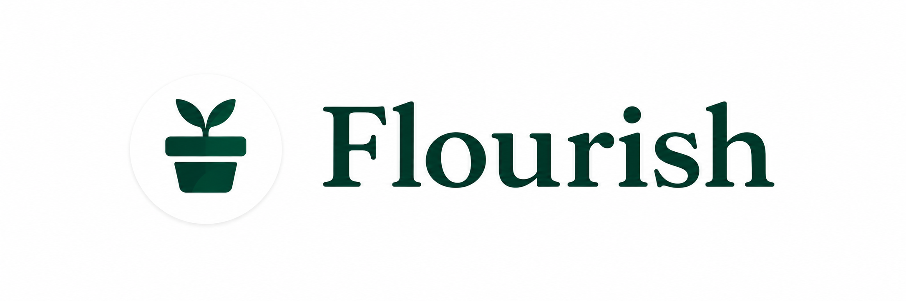
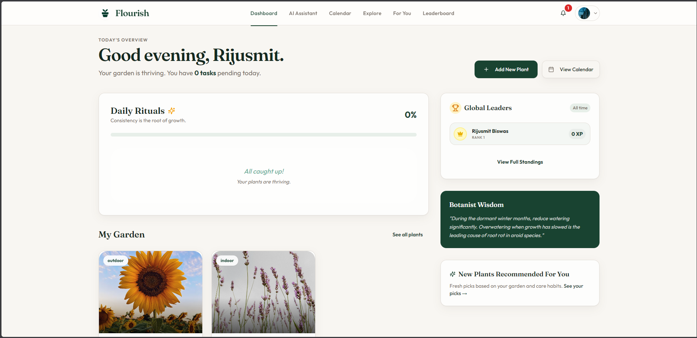

   
  
   
  <i>A look at your digital garden.</i>
   

<h1 align="center">Flourish</h1>

<b>Transform your black thumb into a green one.</b>

  
  
  
  
  
  
  
  
  
  
  

<a href="https://flourish-web-iota.vercel.app/"><b>flourish-web-iota.vercel.app</b></a>

<h2>Hello and welcome to Flourish.</h2>

Most people do not kill plants because they lack care. They kill plants because caring is hard to do consistently. Every plant needs something slightly different. Nobody tells you when to water until it is already too late. You water on Sundays because that is the day you remember. That is not the day your fern actually needs it. By the time the leaves show something is wrong, the damage is already done. Flourish exists because we got tired of that gap between wanting to keep something alive and actually knowing how.

<h2>What Flourish is all about.</h2>

Flourish is not a simple reminder app with a pretty plant picture. It is closer to a second pair of eyes on your garden. It actually knows the difference between a pothos and a peace lily. When you add a plant, it is not a generic entry in a list. It is a living thing with a species, a light requirement and a watering rhythm. All this information is pulled from real horticultural data rather than guessed. The care schedule is not a fixed countdown. It moves when the situation changes. Skip a watering and the plan adjusts instead of just nagging you later. That is the whole idea. We offer care that responds instead of a checklist that does not know it is being ignored. When you are not sure what is going on with a curling leaf or a yellow patch, you do not have to dig through forum threads. You just ask PlantMind. PlantMind is the assistant built into Flourish. It answers real plant questions with the same grounded knowledge behind your care schedules.

   
  
   
  <i>A look at your digital garden.</i>
   

<h2>What it feels like day to day.</h2>

You open the app to a garden and not a dashboard. You see a short list of what actually needs doing today instead of a wall of everything all the time. You check things off and your plants respond to the care you give them. The app quietly notices your progress. A streak forms and your garden health trends upward. You get a small honest sense that you are actually good at this now. This happens not because you memorized a schedule but because something was watching the details for you. If you like friendly competition there is a leaderboard for that too. Keeping a plant alive for six months is a real accomplishment and it should feel like one.

<h2>A walkthrough of the main products.</h2>

<h3>The Dashboard.</h3>

This is the home screen and it is your garden at a glance. It shows today's care tasks, the current health of every plant, and quick actions for the things you actually need to do right now. Nothing is buried and nothing is padded out with filler.

<h3>PlantMind.</h3>

This is the chat assistant built into Flourish. You ask it plant care questions in plain language and it answers with personalized advice grounded in the same data behind your care schedules, not a generic script.

<h3>Calendar.</h3>

This is where every upcoming watering, fertilizing, and health check for your whole garden lives in one place. It gives you the full schedule instead of just today's slice of it.

<h3>Explore.</h3>

This is the plant lookup tool. Search for any plant and see its real care needs, native habitat, and common issues before you decide to bring it home or add it to your garden.

<h3>Recommendations.</h3>

This is where Flourish suggests plants picked for your garden, based on what you already grow and how well you are caring for it. The suggestions are personalized, not a generic bestseller list.

<h3>Leaderboard.</h3>

This is where you see how your gardening streak and score stack up against other Flourish growers. It turns consistent care into something you can actually see progress on.

<h2>The bet we are making.</h2>

Most plant apps assume the hard part is remembering. We think the hard part is knowing what your specific plant needs right now. We consider what has actually happened to it lately. Flourish leans almost all of its intelligence into that goal. We ground recommendations in real plant data first. We use artificial intelligence to fill the gaps and answer what a database cannot. We never pretend a generic tip is personal advice. We also think caring for something living should not feel like administrative work. The app is built to feel warm rather than clinical. It is more like a garden journal that happens to be smart and less like a spreadsheet with push notifications.

<h2>The technical stack.</h2>

Flourish is a monorepo with a React frontend talking to a FastAPI backend. Firebase handles the account and data layer for both. The frontend uses React 18 and TypeScript built with Vite. The user interface uses Tailwind CSS and Radix primitives. TanStack React Query handles server state and React Router handles navigation. We use react hook form and Zod for forms. Charts use Recharts and PlantMind replies are rendered with react markdown. The backend uses FastAPI on Python 3.12 served by Uvicorn. The care agent logic runs on LangChain with Groq for language model inference and Tavily for grounded web search. APScheduler drives the recurring jobs like streak checks and task digests when running on a host with a persistent process. Perenual supplies the deterministic plant facts like watering cadence and sunlight needs. Groq fills in what a database cannot answer. OpenWeather adds weather adjustments and Unsplash sources plant photography. The platform uses Firebase for Google authentication and Firestore for the database and Storage for images. We also use the Trigger Email extension for notification delivery. The app is deployed as a Vite build on Vercel and a Docker image on Render. GitHub Actions runs continuous integration and keeps the API warm.

<h2>Here is what you get at a glance.</h2>

Care facts come from a real horticultural database and not an artificial intelligence improvising a watering schedule.

Schedules actually move when you miss a watering and the plan adjusts instead of quietly falling out of sync with reality.

PlantMind is an assistant that actually answers plant questions backed by the same data as your care plan.

Progress feels like real progress with streaks and garden health trends and a leaderboard for the mildly competitive.

<h2>Try it out today.</h2>

Sign in with Google and add the plant that is currently judging you from across the room. See what Flourish thinks it actually needs. Visit <a href="https://flourish-web-iota.vercel.app/">flourish-web-iota.vercel.app</a> to get started.

Are you building on this or just curious how it is put together? The engineering documents live in the <a href="docs/">docs folder</a> and start with the <a href="docs/01-PRD.md">product requirements document</a>.

